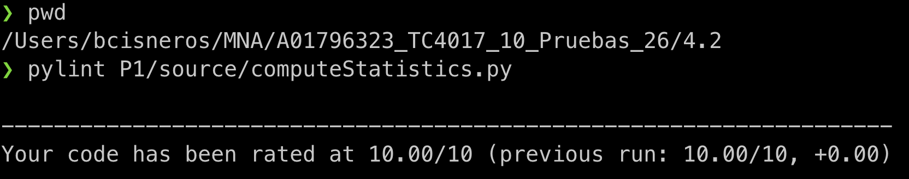
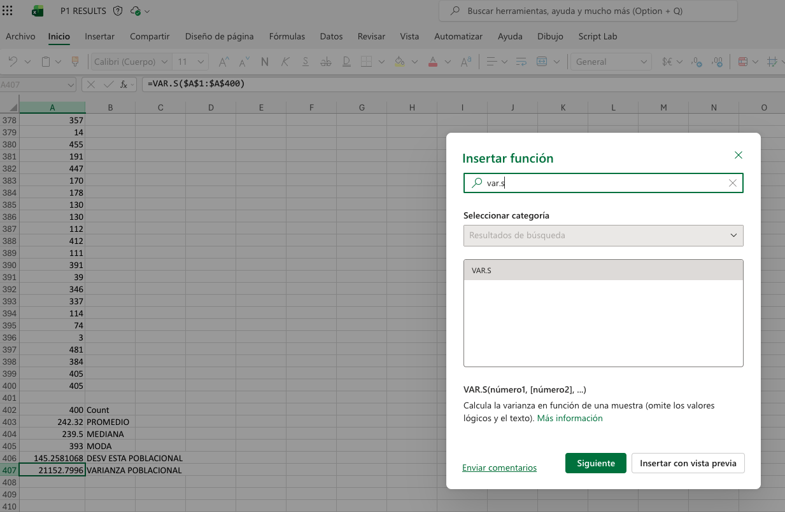
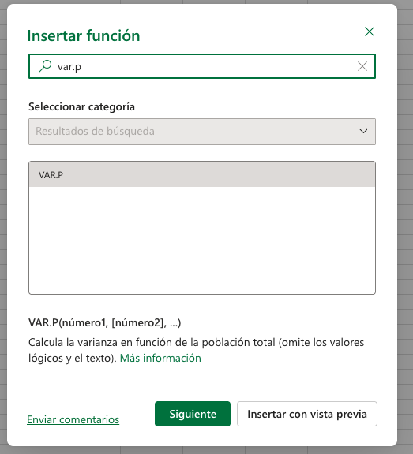
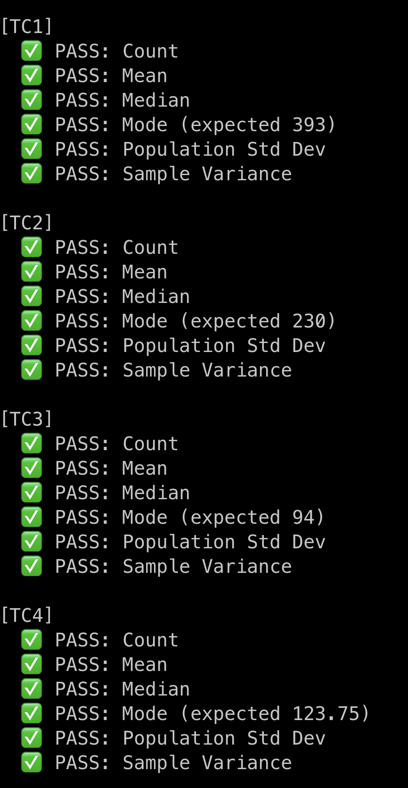
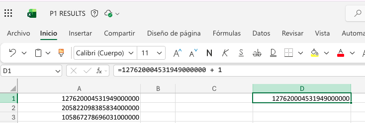
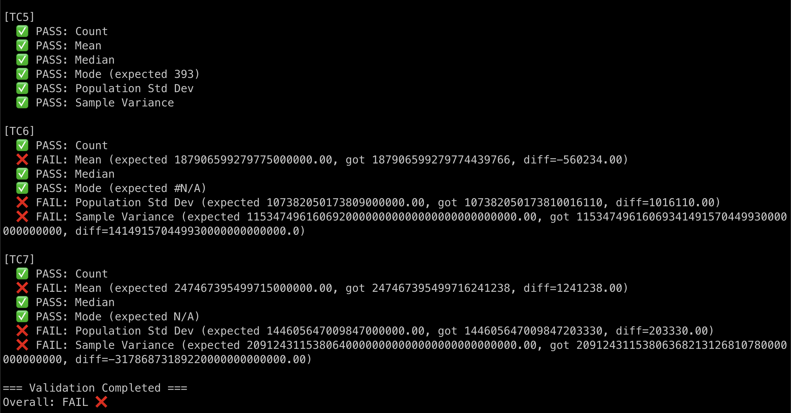
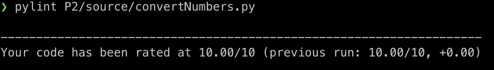
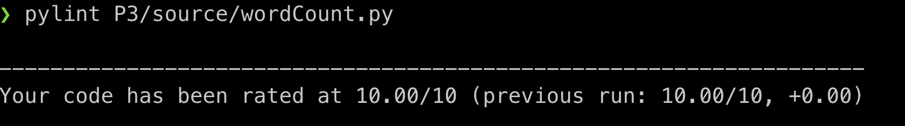
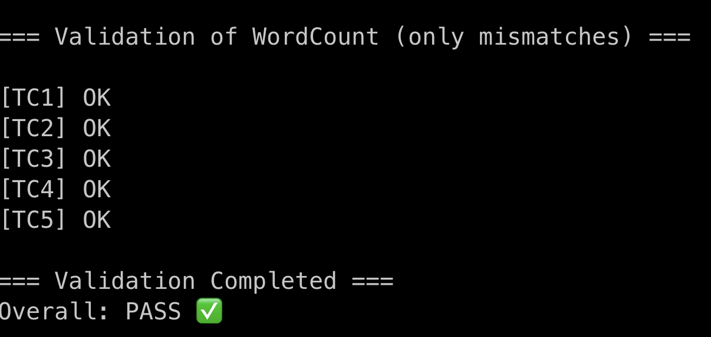

# Activity 4.2 – Programming Exercises (Python, PEP‑8, PyLint)

## 📘 Overview

This repository contains the implementation of the **three programming exercises** required for **Activity 4.2**:

1. Descriptive Statistics Calculator
2. Decimal to Binary/Hexadecimal Converter
3. Word Frequency Counter

All programs:

- ✔ Are implemented in Python
- ✔ Follow PEP‑8 standards
- ✔ Have been validated using PyLint
- ✔ Use basic algorithms only (no math/statistics or conversion libraries)
- ✔ Generate both console output and results files
- ✔ Include error handling
- ✔ Display execution time

The assignment focuses on:

- Understanding the importance of coding style.
- Identifying errors through static analysis tools.
- Applying recognized industry coding standards.
- Running and documenting all test cases for the three programs.

## Project Content

```
.
├── P1
│   ├── results
│   │   ├── StatisticsResults.txt
│   │   ├── excel_error.png
│   │   ├── excel_variance_population.png
│   │   ├── excel_variance_sample.png
│   │   ├── pylint_results_p1.png
│   │   ├── tc1_4_results.png
│   │   └── tc5_7_results.png
│   ├── source
│   │   ├── computeStatistics.py
│   │   └── validateResults.py
│   ├── test.sh
│   └── tests
│       ├── A4.2.P1.Results-errata.txt
│       ├── TC1.txt
│       ├── TC2.txt
│       ├── TC3.txt
│       ├── TC4.txt
│       ├── TC5.txt
│       ├── TC6.txt
│       ├── TC7.txt
│       └── example.txt
├── P2
│   ├── results
│   │   ├── ConvertionResults.txt
│   │   ├── pylint_results_p2.png
│   │   └── validation_results.png
│   ├── source
│   │   ├── convertNumbers.py
│   │   └── validateResults.py
│   ├── test.sh
│   └── tests
│       ├── A4.2.P2.Results_fixed.txt
│       ├── A4.2.P2.Results_original.txt
│       ├── TC1.txt
│       ├── TC1_original.txt
│       ├── TC2.txt
│       ├── TC3.txt
│       ├── TC4.txt
│       └── example.txt
├── P3
│   ├── results
│   │   ├── WordCountResults.txt
│   │   ├── pylint_results_p3.png
│   │   └── validation_results.png
│   ├── source
│   │   ├── validateResults.py
│   │   └── wordCount.py
│   ├── test.sh
│   └── tests
│       ├── TC1.Results.txt
│       ├── TC1.txt
│       ├── TC2.Results.txt
│       ├── TC2.txt
│       ├── TC3.Results.txt
│       ├── TC3.txt
│       ├── TC4.Results.txt
│       ├── TC4.txt
│       ├── TC5.Results.txt
│       ├── TC5.txt
│       └── example.txt
├── .pylintrc
├── README.md
└── lint.sh
```

Each program (`P1`, `P2` and `P3`) contains the following directories and files:

- `source`: contains the source code of each program. Also there is a file called `validateResults.py` that helps to compare the expected results with the actual results
- `tests`: contains files with test cases that you can pass to the program. They normally start with `TC` prefix (e.g `TC1.txt`), but is not mandatory.
- `results`: contains the output of the program and screenshots.
- `test.sh`: utility script to run the program and validate the results automatically

Other files are:

- `.pylintrc`: contains the rule configuration to validate code conventions following [PEP8 guidelines](https://peps.python.org/pep-0008).
- `lint.sh`: utility script to run pylint for each file and report code convention errors

## 🧮 Program 1 — Compute Statistics

### Purpose

Reads a file of numeric values and computes:

- Count
- Mean
- Median
- Mode (supports multiple modes)
- Population & Sample Variance
- Population & Sample Standard Deviation
- Elapsed execution time

### Key Features

- Detects **invalid tokens** (letters mixed with numbers, commas, malformed entries, etc.).
- Supports **very large numbers** (e.g., TC6, TC7) with high‑precision processing.
- Implements both **population** and **sample** formulas.
- Fully compliant with **PEP‑8** and validated with **PyLint**.
- Support multiple files

### Example

File Content:

```
10
20
30
10
40
50
60
70
80
100
```

Execute program:

```
$ cd P1
$ python source/computeStatistics.py tests/example.txt
=== Descriptive Statistics (tests/example.txt) ===

Metric                  |      Value
------------------------+-----------
Count                   |         10
Mean                    |         47
Median                  |         45
Mode                    |         10
Population Std Dev      |         29
Population Variance     |        841
Sample Std Dev          |  30.568684
Sample Variance         |  934.44444
Elapsed Time (seconds)  |  0.0019343

=== Batch Summary ===
Files processed: 1
Total elapsed time (seconds): 0.001976
```

### ✔ Program Requirements Check

- ✔ **Req 1**: The program is be invoked from the command line and receives a file as parameter.
  The file contains a list of items (presumably numbers).
- ✔ **Req 2**: The program computes all descriptive statistics using basic algorithms only:
  - Mean
  - Median
  - Mode
  - Standard Deviation
  - Variance

  The results are printed both on screen and in a file named `StatisticsResults.txt`.

- ✔ **Req 3**: The program handles invalid data inside the file. Errors are displayed on the console, and execution continues.

- ✔ **Req 4**: The program name is `computeStatistics.py`

- ✔ **Req 5**: The invocation format is:

  ```
  python computeStatistics.py fileWithData.txt
  ```

- ✔ **Req 6**: The program supports files with hundreds to thousands of data items.

- ✔ **Req 7**: Execution time is displayed and written into the results file.

- ✔ **Req 8**: The program IS PEP‑8 compliant.

### Skills Demonstrated

- Control structures
- Console I/O
- Mathematical computation
- File management
- Error handling

### Evaluation Results

#### 1. Static Analysis — No issues detected



#### 2. All test cases passing

To facilitate the result checking, run the following command:

```
$ cd P1
$ ./test.sh
```

This executes the program against each test case and collect the results into `P1/results/StatisticsResults.txt`. Then it run the validation against the expected results on `P1/tests/A4.2.P1.Results-errata.txt` file.

> **Note**: Inside the activity specifications said that we need to calculate the Population Variance, but inside the expected results it shows the Sample Variance as expected. This is because the Excel file provided uses the `VAR.S` instead of `VAR.P` function as shown in the following image:
> 
> 




> **Note**: TC6 and TC5 are failing not due the results are wrong, but the expected results are calculated incorrectly. Excel does not calculates correctly when the numbers have more than 15 digits as explained in the following [video](https://www.youtube.com/watch?v=IZiKChu0yQM)






## 🔢 Program 2 — Converter (Decimal → Binary / Hex)

### Purpose

Converts decimal integers (positive, negative, and invalid cases) into:

- Binary
- Hexadecimal

### Key Features

- Preserves the input order.
- Invalid entries are reported as **#VALUE!** as shown in the expected output files.
- Supports negative numbers.
- Outputs formatted conversion tables.
- Fully PEP‑8 compliant and validated with PyLint.
- Support multiple files

### Example

File Content:

```
1
5
10
23
45
128
256
9999
10299
```

Execute program:

```
$ cd P2
$ python source/convertNumbers.py tests/example.txt
=== tests/example.txt Conversions (Line, Decimal → Binary, Hex) ===

Line  |  Decimal  |          Binary  |   Hex
------+-----------+------------------+------
   1  |        1  |               1  |     1
   2  |        5  |             101  |     5
   3  |       10  |            1010  |     A
   4  |       23  |           10111  |    17
   5  |       45  |          101101  |    2D
   6  |      128  |        10000000  |    80
   7  |      256  |       100000000  |   100
   8  |     9999  |  10011100001111  |  270F
   9  |    10299  |  10100000111011  |  283B

Total valid items: 9
Elapsed Time (seconds): 0.000279
```

### ✔ Program Requirements Check

- ✔ **Req 1**: Program is invoked from command line with a file containing numbers.
- ✔ **Req 2**: Convert each number to:
  - Binary (base 2)
  - Hexadecimal (base 16)

  using basic algorithms only (no built‑in converters).
  Output is printed on screen and in: `ConvertionResults.txt`

- ✔ **Req 3**: Invalid data is detected and reported on console. Program continues execution.
- ✔ **Req 4**: Program name is `convertNumbers.py`
- ✔ **Req 5**: The invocation format is:

  ```
  python convertNumbers.py fileWithData.txt
  ```

- ✔ **Req 6**: Process files ranging from hundreds to thousands of items.
- ✔ **Req 7**: Execution time is shown and written into the results file.
- ✔ **Req 8**: Strictly follows PEP‑8.

### Skills Demonstrated

- Control structures
- Console I/O
- Error handling


### Evaluation Results

#### 1. Static Analysis — No issues detected



#### 2. All test cases passing

To facilitate the result checking, run the following command:

```
$ cd P2
$ ./test.sh
```

This executes the program against each test case and collect the results into `P2/results/ConvertionResults.txt`. Then it run the validation against the expected results on `P2/tests/A4.2.P2.Results_fixed.txt` file.


> **Note**: I replaced the content of `TC1.txt` with the correct input values found inside `P2/tests/A4.2.P2.Results_original.txt` due an error on that file for this test case was showing extra columns. The original content is inside `P2/tests/TC1_original.txt`. 

## 📝 Program 3 — Count Words

### Purpose

Processes a text file and generates a frequency table of unique words.

### Operations

- Removes non‑alphabetic characters.
- Counts total valid words and distinct words.
- Orders output by:
  - Higher frequency
  - Alphabetically
- Support multiple files

### Example

File Content:

```
four
one
two
three
four
two
three
four
three
four
```

Execute program:

```
$ cd P3
$ python source/wordCount.py tests/example.txt
=== tests/example.txt — Word Count (Distinct Words & Frequencies) ===

No.  |  Word   |  Frequency
-----+---------+-----------
  1  |  four   |          4
  2  |  three  |          3
  3  |  two    |          2
  4  |  one    |          1

Total valid words: 10
Distinct words: 4
Elapsed Time (seconds): 0.000198
```

### ✔ Program Requirements Check

- ✔ **Req 1**: The program is invoked from a command line. The program receives a file as parameter. The file will contain a words (presumable between spaces).

- ✔ **Req 2**: The program identifies all distinct words and the frequency of them (how many times the word “X” appears in the file). The results are printed on a screen and on a file named `WordCountResults.txt`. All computation is calculated using the basic algorithms, not functions or libraries.

- ✔ **Req 3**: The program includes the mechanism to handle invalid data in the file. Errors are displayed in the console and the execution continues.
- ✔ **Req 4**: The name of the program is `wordCount.py`
- ✔ **Req 5**: The minimum format to invoke the program is as follows:
  ```
  python wordCount.py fileWithData.txt
  ```
- ✔ **Req 6**: The program manages files having from hundreds of items to thousands of items.
- ✔ **Req 7**: The program includes at the end of the execution the time elapsed for the execution and calculus of the data. This number is included in the results file and on the screen.
- ✔ **Req 8**: Is compliant with PEP8.

### Skills Demonstrated

- Control structures
- Console Input/Output
- Error Handling
- String manipulation

### Evaluation Results

#### 1. Static Analysis — No issues detected



#### 2. All test cases passing

To facilitate the result checking, run the following command:

```
$ cd P3
$ ./test.sh
```

This executes the program against each test case (`P3/tests/TC{N}.txt`) and collect the results into `P2/results/WordCountResults.txt`. Then it run the validation against the expected results on `P3/tests/TC{N}.Results.txt` file.



> **Note**: My solution order the results first by frequency in Descending order, then by word alphabetically. The expected results seems does not have a specific order, so I was unable to identify the rule for that. 
