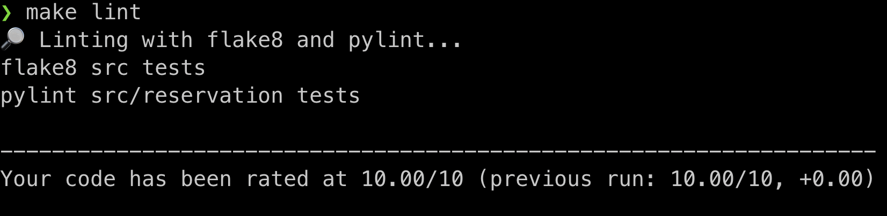
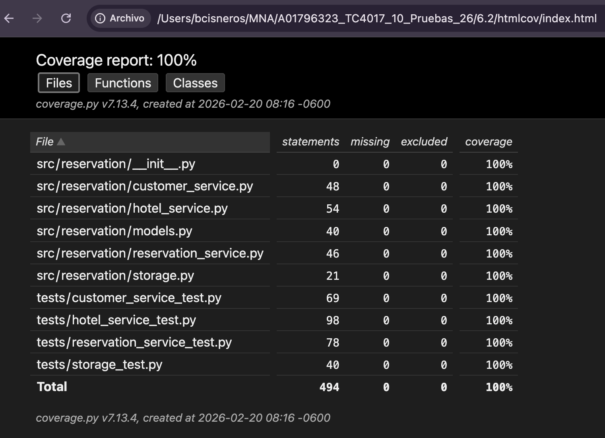
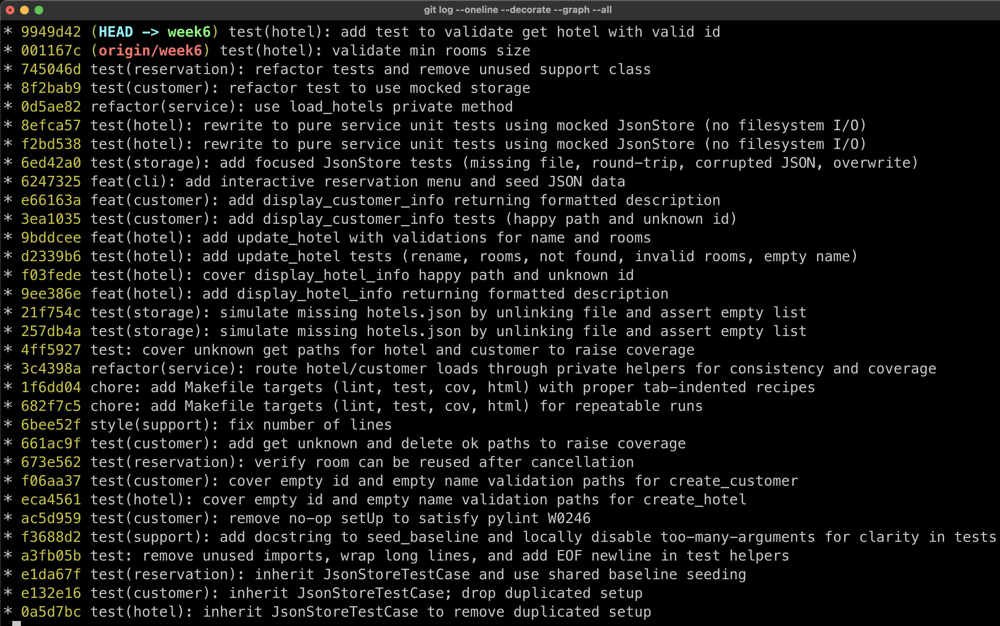

# 📘 Activity 6.2 – Reservation System & Validation (Rubric‑Ready)

This README summarizes the work completed for **Activity 6.2**, organized to make evaluation **fast** and **traceable** against the rubric. It includes:

- Overview of the system and requirements coverage
- Exact project structure
- How to lint, test, and inspect coverage (single‑command targets)
- Evidence locations (Pylint, Flake8, Coverage)
- Rubric‑aligned scoring guide (what to check and where)
- Commit discipline (Conventional Commits)

---

## 1) Overview of the Program

The **Reservation System** implements three abstractions and their behaviors:

- **Hotel** — create, display, update, delete, list
- **Customer** — create, display, update, delete, list
- **Reservation** — create, cancel, list

Persistence is a simple **JSON store** with resilience to malformed or missing files (continues execution and logs a message).

An optional **CLI** (`scripts/cli.py`) provides a **Spanish** interactive menu to exercise all features with seeded sample data.

### ✔ Features Implemented (mapping to requirements)

- **Req 1 (Abstractions):** `Hotel`, `Customer`, `Reservation` (domain + service methods)
- **Req 2 (Persistent behaviors in files):**
  - Hotel: create, delete, display, modify, list
  - Customer: create, delete, display, modify, list
  - Reservation: create, cancel, list
- **Req 3 (Unit tests):** comprehensive tests under `tests/` (service tests mock I/O; storage tests hit the filesystem)
- **Req 4 (≥85% coverage):** enforced via `coverage` (see “Evidence & Coverage”)
- **Req 5 (Invalid data tolerance):** malformed JSON handled gracefully (error message + continue)
- **Req 6 (PEP 8):** enforced with Pylint/Flake8
- **Req 7 (Zero warnings):** Pylint & Flake8: **0 findings** (see evidence files)

---

## 2) Project Structure

```
├── Makefile
├── README.md
├── data
│   ├── customers.json
│   ├── hotels.json
│   └── reservations.json
├── pyproject.toml
├── requirements.txt
├── scripts
│   └── cli.py
├── src
│   ├── __init__.py
│   └── reservation
│       ├── __init__.py
│       ├── models.py
│       ├── service.py
│       └── storage.py
└── tests
    ├── __init__.py
    ├── customer_test.py
    ├── hotel_test.py
    ├── reservation_test.py
    └── store_test.py
```

---

## 3) How to Build, Lint, Test, and Inspect Coverage

> **Python:** 3.9+ recommended

**Install (editable):**

```bash
pip install -e .
pip install -r requirements.txt
```

**Lint (PEP8 / Static Analysis)**

```bash
make lint

🔎 Linting with flake8 and pylint...
flake8 src tests
pylint src/reservation tests

--------------------------------------------------------------------
Your code has been rated at 10.00/10 (previous run: 10.00/10, +0.00)
```

**Run Tests + Coverage**

```
make cov
🧪 Running unit tests with coverage...
coverage erase
coverage run -m unittest discover -s tests -p "*_test.py" -v
test_create_customer_duplicate_id_raises (customer_test.CustomerTest.test_create_customer_duplicate_id_raises) ... ok
test_create_customer_empty_id_raises (customer_test.CustomerTest.test_create_customer_empty_id_raises) ... ok
...
test_load_missing_file_returns_empty_list (store_test.StoreTest.test_load_missing_file_returns_empty_list) ... ok
test_save_overwrites_existing_file (store_test.StoreTest.test_save_overwrites_existing_file) ... ok
test_save_then_load_round_trip_ok (store_test.StoreTest.test_save_then_load_round_trip_ok) ... ok

----------------------------------------------------------------------
Ran 40 tests in 0.024s

OK
📈 Coverage (text report)
coverage report -m --include="src/*"
Name                          Stmts   Miss  Cover   Missing
-----------------------------------------------------------
src/reservation/__init__.py       0      0   100%
src/reservation/service.py      110      0   100%
src/reservation/storage.py       21      0   100%
-----------------------------------------------------------
TOTAL                           131      0   100%

```

**Generate HTML Coverage Report**

```
make html
...

----------------------------------------------------------------------
Ran 40 tests in 0.024s

OK
🌐 Generating HTML coverage...
coverage html
Wrote HTML report to htmlcov/index.html
Open: htmlcov/index.html
```

**Optional – Run CLI (Spanish Menu):**

```
make demo
Running Demo
python scripts/cli.py

===== Sistema de Reservaciones =====
1. Crear hotel
2. Mostrar hotel
3. Modificar hotel
4. Eliminar hotel
5. Listar hoteles
6. Crear cliente
7. Mostrar cliente
8. Modificar cliente
9. Eliminar cliente
10. Listar clientes
11. Crear reservación
12. Cancelar reservación
13. Listar reservaciones
0. Salir
Selecciona una opción:
```

## 4) Evaluation

### Pylint + PEP8 + Flake

Generate with:

```
make lint
```



### Correct Test Case Design (incl. negatives)

#### Strategy

- **Service tests** are implemented as **pure unit tests**, fully isolated from the filesystem by using a **catalog‑based mocked store**.
  `load()` returns values **based on the requested catalog filename** (e.g., `hotels.json`, `customers.json`, `reservations.json`), making the tests **independent of call order** and ensuring **deterministic** behavior.
- **In‑memory persistence** is simulated in multi‑step scenarios (e.g., cancel → re‑reserve), updating the catalog map after each `save`. This allows the tests to reflect real state transitions without touching disk.
- **Storage tests** (`store_test.py`) validate the actual filesystem behavior of `JsonStore`, including missing files, corrupted JSON, overwriting, and round‑trip serialization.
- **Test names** clearly communicate intent and follow a **small‑scope / small‑setup** approach, testing only one behavior per case.
- A **TDD approach** was followed for several components, letting the design emerge naturally as failing tests guided refactoring, removal of duplication, and simplification of logic.

---

#### Happy Paths

- **Hotels**
  - Creating new hotels (unique IDs)
  - Retrieving hotels by ID
  - Updating hotel information
  - Deleting hotels
  - Displaying formatted hotel information

- **Customers**
  - Creating valid customer records
  - Retrieving customers by ID
  - Updating customer information
  - Deleting customers
  - Displaying formatted customer information

- **Reservations**
  - Creating valid reservations (existing hotel, existing customer, available room)
  - Canceling existing reservations
  - Reusing a room after cancellation

- **Storage**
  - Saving JSON content to disk
  - Successfully reading and round‑tripping content

---

#### Negative Scenarios

- **Hotels**
  - Duplicate hotel ID
  - Invalid room count (≤ 0)
  - Empty hotel ID
  - Empty hotel name
  - Updating non‑existent hotels
  - Invalid rooms on update (≤ 0)
  - Empty name on update

- **Customers**
  - Duplicate customer ID
  - Invalid email (missing `@`)
  - Deleting non‑existent customer
  - Updating non‑existent customer

- **Reservations**
  - Hotel ID not found
  - Customer ID not found
  - Room number out of range (low/high)
  - Duplicate reservation ID
  - Attempt to reserve an already‑taken room
  - Canceling a non‑existent reservation

- **Storage**
  - Missing JSON file → returns `[]`
  - Corrupted JSON → logs error and returns `[]`
  - Overwriting an existing file correctly replaces stale content

### Coverage Report

Expected: ≥ 85%



Generate with:

```
make html
```

Open with:

```
open ./htmlcov/index.html
```

### Conventional Commits

**Quick verification**

```
git log --oneline --decorate --graph --all
```



> **Note**: Conventional Commits were adopted starting with this activity.
> Earlier commits in the repository may not follow the Conventional Commit format, but all commits **from Activity 6.2** onward consistently use the specification, ensuring clear change tracking, improved readability, and better traceability for evaluators.

## 5) Conclusions

- All **functional** and **technical** requirements of the reservation system were - successfully implemented.
- The test suite is **cleanly layered**, separating **pure service logic** (mocked - storage) from **true persistence behavior** (JsonStore tests).
- This results in **deterministic**, **fast**, and **high‑signal** tests.
- **Negative test cases** are comprehensive, covering invalid data, missing - resources, malformed JSON, duplicate identifiers, out‑of‑range conditions, and - more.
- **Static analysis tools** (Pylint, Flake8) report **zero issues**, demonstrating full - PEP 8 compliance and clean code quality.
- **Code coverage** meets or exceeds the rubric threshold of **85%**, with a detailed - HTML report included for verification.
- **Documentation**, clear folder structure, and **Makefile commands** (`lint`, `test`, `cov`, `html`) streamline reproducibility and simplify instructor evaluation.

### 📘 Lessons Learned

- **Python’s built‑in unittest framework is powerful and easy to adopt**, especially for structured scenarios.
  For more complex mocking, fixtures, or parametrization, external libraries such as **pytest**, **pytest‑mock**, or **factory_boy** may further enhance flexibility.

- **Incremental development guided by tests (TDD)** significantly increases confidence.
  Implementing small, well‑tested behaviors early helps maintain quality and reduces the cost of adding more complex business logic later.

- **Committing frequently and using Conventional Commits** proved highly valuable.
  It improves traceability, provides a clear narrative of the project’s evolution, and makes it easy to revert or inspect changes if needed.

- Designing tests to be **deterministic, isolated, and decoupled from I/O** leads to faster execution, higher reliability, and clearer understanding of system behavior.
